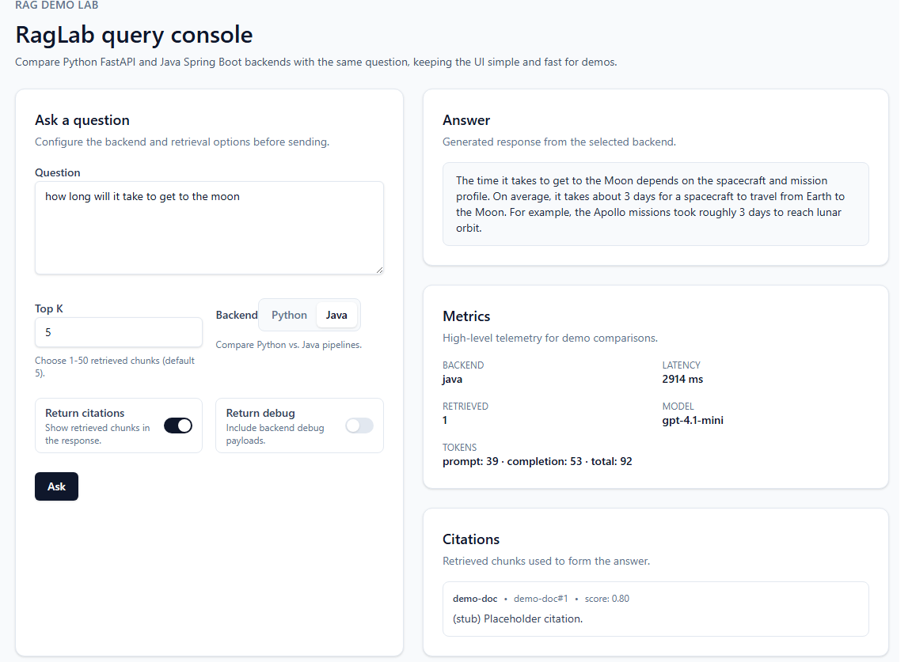

# RagLab

**RagLab** is an experimental lab for building, comparing, and evaluating **document-centric AI systems** (RAG and beyond) across **multiple backend implementations**.

The project is intentionally designed as an **engineering lab**, not a product:

* one UI
* multiple backends
* shared API contract
* observable tradeoffs

---

## What this project demonstrates

RagLab focuses on **how engineers should approach AI systems**, not hype-driven demos.

It demonstrates:

* Treating LLM-backed systems as **software systems**
* Backend parity across **Python (FastAPI)** and **Java (Spring Boot)**
* Runtime backend switching from a single UI
* Clear API contracts and reproducible experiments
* Cost, latency, and behavior comparison
* Using PostgreSQL with pgvector for document storage and semantic search

---

## High-level architecture

```
Browser
  |
  v
Next.js 16 UI (RagLab)
  |
  |  HTTP / JSON (shared contract)
  |
  v
Nginx (API Gateway)
  |
  +--> Python API (FastAPI) :8000
  |
  +--> Java API (Spring Boot) :8080
  |
  v
PostgreSQL + pgvector (documents, chunks, embeddings, runs)
```

### How it works

1. **User submits a query** through the Next.js UI
2. **Backend selection**: UI sends request with `backend: "python"` or `backend: "java"`
3. **Nginx routing** routes to the appropriate backend:
   - `/api/python/*` → Python FastAPI container
   - `/api/java/*` → Java Spring Boot container
4. **Backend processing**:
   - Retrieves relevant document chunks from PostgreSQL (using vector similarity)
   - Builds a prompt with the retrieved context
   - Calls OpenAI API for the answer
   - Logs the query run (latency, tokens, status) to `query_runs` table
5. **Response** returned to UI with answer, citations, and metrics

All backends implement the same API contract defined in [`docs/API.md`](docs/API.md).

---

## Repository structure

```text
RagLab/
├── apps/
│   ├── web/           # Next.js 16 UI
│   ├── api-python/    # FastAPI backend
│   └── api-java/      # Spring Boot backend
├── infra/
│   ├── db/
│   │   └── init.sql   # Postgres schema (documents, chunks, embeddings, query_runs)
│   └── nginx/
│       └── nginx.conf # API gateway routing
├── docs/
│   ├── PRD.md
│   ├── ARCHITECTURE.md
│   └── API.md
├── docker-compose.yml
├── .env               # Required: OPENAI_API_KEY
└── README.md
```

---

## Local development (Docker)

### Prerequisites

* Docker + Docker Compose
* OpenAI API key

### Setup

1. **Copy the environment file** and add your OpenAI API key:
   ```bash
   cp .env.example .env
   # Edit .env and add: OPENAI_API_KEY=sk-...
   ```

2. **Start all services**:
   ```bash
   docker compose up --build
   ```

### Accessing the services

Once running:

| Service | URL |
|---------|-----|
| UI | [http://localhost/](http://localhost/) |
| Python API Health | [http://localhost/api/python/api/v1/health](http://localhost/api/python/api/v1/health) |
| Java API Health | [http://localhost/api/java/api/v1/health](http://localhost/api/java/api/v1/health) |
| pgAdmin | [http://localhost:5050](http://localhost:5050) (admin@raglab.dev / admin) |

### Quick smoke test

```bash
# Test Python backend
curl -X POST http://localhost/api/python/api/v1/rag/query \
  -H 'Content-Type: application/json' \
  -d '{"query":"What is RAG?","topK":5}'

# Test Java backend
curl -X POST http://localhost/api/java/api/v1/rag/query \
  -H 'Content-Type: application/json' \
  -d '{"query":"What is RAG?","topK":5}'
```

### Stopping services

```bash
docker compose down
```

To reset the database (WARNING: deletes all data):
```bash
docker compose down -v
docker compose up --build
```

---

## Database schema

The PostgreSQL database stores:

- **`documents`** - Metadata for each document (title, source, tags)
- **`chunks`** - Text chunks split from documents (for retrieval)
- **`chunk_embeddings`** - Vector embeddings for semantic search (pgvector)
- **`query_runs`** - Log of all queries with latency, tokens, and status

See [`infra/db/init.sql`](infra/db/init.sql) for the full schema.

---

## Core concepts

### Backend switching

The UI includes a backend selector (Python | Java).
The same user action can be routed to different backends **without redeploying** the UI.

This enables:
* direct comparison
* parity validation
* experimentation without duplication

### Shared API contract

All backends implement the same endpoints and schemas defined in [`docs/API.md`](docs/API.md).

The UI does not know *how* a backend works — only that it behaves correctly.

---

## Troubleshooting

### Java API fails with "OPENAI_API_KEY is not configured"

Make sure you've created the `.env` file with your OpenAI API key:
```bash
OPENAI_API_KEY=sk-proj-...
```

### "relation 'query_runs' does not exist" error

The database wasn't initialized properly. Reset the database volume:
```bash
docker compose down -v
docker compose up --build
```

### Checking logs

```bash
# All services
docker compose logs

# Specific service
docker logs raglab-api-java
docker logs raglab-api-python
docker logs raglab-web
```

---

## Current status

* ✅ Next.js 16 UI with backend switching
* ✅ Python FastAPI backend with OpenAI integration
* ✅ Java Spring Boot backend with OpenAI integration
* ✅ PostgreSQL + pgvector database schema
* ✅ Docker + nginx API gateway routing
* ✅ Query logging and metrics tracking
* 🔄 Document ingestion and embedding (in progress)

---

## Non-goals

RagLab is **not**:

* a production system
* a hosted SaaS
* an AI "assistant"
* a fine-tuning or training platform

It is a **lab** for controlled experimentation and learning.

---

## Why this exists

This project exists to answer a simple question:

> *Can you design and reason about AI systems the same way you design and reason about any other software system?*

RagLab's answer is: **yes — deliberately, transparently, and without hype.**

---

## License

MIT

---
